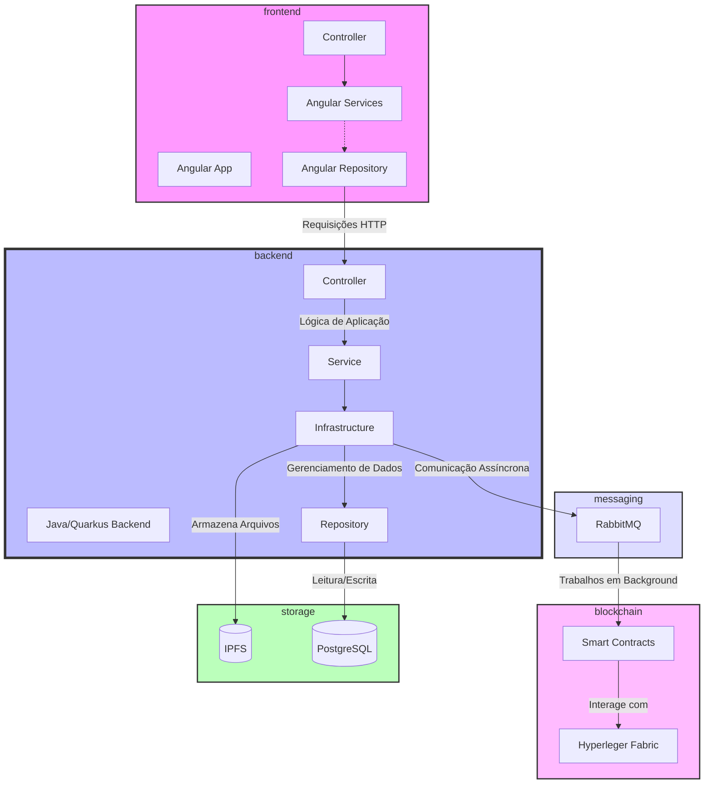
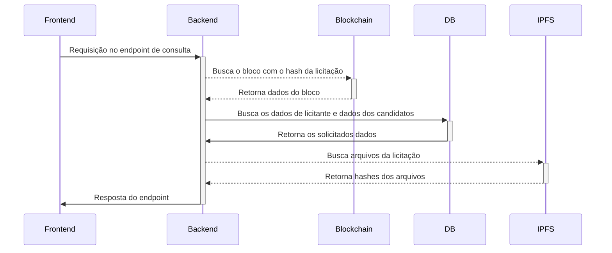
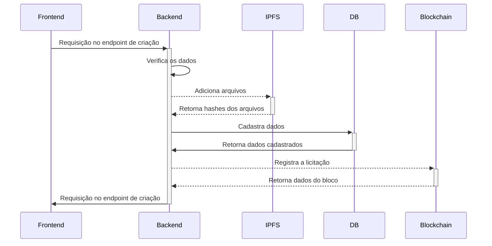
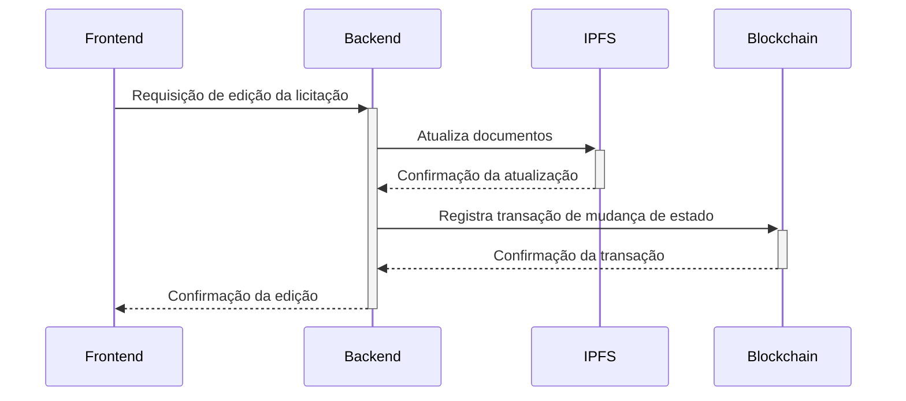

# blockchain-tcc-licitacoes

## PROJETO DE TCC UTILIZANDO HYPERLEDGER BESU

### PASSO A PASSO DE EXECUÇÃO DO PROJETO

1. Realizar o download dos binários do besu na versão 24.1.2
```bash
    curl -o besu.zip https://hyperledger.jfrog.io/artifactory/besu-binaries/besu/24.1.2/besu-24.1.2.zip
```
2. Descompactar o arquivo zip do besu
```bash
    unzip besu.zip -d besu
```
3. Verificar se o besu está funcionando
```bash
    .besu/bin/besu --help
```
4. Iniciar a blockchain do besu em modo de desenvolvimento
```bash
./bin/besu --network=dev --rpc-http-cors-origins="all" --host-allowlist="*" --rpc-ws-enabled --rpc-http-enabled
```


## Artefatos de Software

### Diagrama da arquitetura


### DIAGRAMAS DE SEQUENCIA

#### BUSCA DE LICITAÇÃO

#### CADASTRO DE LICITAÇÃO


#### EDIÇÃO DE LICITAÇÃO

